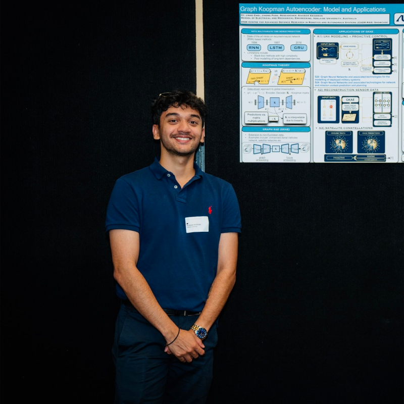

  

    
    

      <h1 style="margin: 0 0 4px 0; font-size: 1.75em; color: #1a1a1a; border-bottom: none; padding-bottom: 0; line-height: 1.2;">Dr. Sivaram Krishnan</h1>
      
Research Fellow

      

        School of Electrical and Mechanical Engineering (EME) 
        Adelaide University | Adelaide, SA 5000, Australia
      

      

        <a href="mailto:sivaram.krishnan@adelaide.edu.au" style="text-decoration: none; background: #ffffff; color: #333; padding: 4px 10px; border-radius: 6px; font-size: 0.82em; border: 1px solid #ced4da; font-weight: 500;">📧 Email</a>
        <a href="https://scholar.google.com/citations?user=3HX0ZDMAAAAJ&hl=en" target="_blank" style="text-decoration: none; background: #4285f4; color: #ffffff; padding: 4px 10px; border-radius: 6px; font-size: 0.82em; font-weight: 500;">Google Scholar</a>
        <a href="https://www.linkedin.com/in/sivaram-krishnan11/" target="_blank" style="text-decoration: none; background: #0a66c2; color: #ffffff; padding: 4px 10px; border-radius: 6px; font-size: 0.82em; font-weight: 500;">LinkedIn</a>
      

      

        GNNs
        6G NTN
        Koopman Theory
        Reinforcement Learning
      

    

  

## About Me

I am a Postdoc in the **School of Electrical and Mechanical Engineering (EME)** at **Adelaide University**, where I also completed my Ph.D. in Electrical and Mechanical Engineering (2022–2026) under the supervision of Prof. Jinho Choi, Prof. Jihong Park, and A/Prof. Brian Ng. 

My research focuses on **Graph-based Methods for Prediction and Control**, with a particular emphasis on AI for wireless networks, Graph Neural Networks (GNNs), Spatio-Temporal prediction, Koopman theory, and Reinforcement Learning (RL). I currently work on GNN and SDN architectures for **6G LEO satellite mega-constellations** and Non-Terrestrial Networks (NTN).

---

## Research Interests

* **AI for Wireless Networks & 6G NTN:** Satellite mega-constellations, UAV routing, and covert communications.
* **Graph Neural Networks (GNN):** Spatio-temporal prediction, graph signal processing, and federated subgraph learning.
* **Dynamical Systems & Control:** Koopman theory for non-linear dynamics, predictive optimization, and reinforcement learning.

---

## Recent News 

* **[2026]** – Paper accepted: *"Reinforcement Learning for Opportunistic Routing in Software-Defined LEO–Terrestrial Systems"* in *IEEE Wireless Communications Letters*.
* **[2025]** – Paper accepted: *"Learning Time-Varying Graph Signals via Koopman"* in *IEEE Transactions on Signal and Information Processing over Networks (TSIPN)*.
* **[2025]** – Presented research at **IEEE ICASSP 2025** and **IEEE IJCNN 2025**.

---

## Education

* **Ph.D. in Electrical and Mechanical Engineering** | *Adelaide University* (2022 – 2026)  
  *Thesis:* Graph-based Methods for Prediction and Control
* **Master of Data Science** | *Deakin University* (2020 – 2022)  
* **Bachelor of Computer Engineering** | *Sinhgad Academy of Engineering* (2014 – 2018)

---

## Contact & Location

* **Office:** Level 3, Ingkarni Wardli, Adelaide University, SA 5005
* **Department:** School of Electrical & Mechanical Engineering
